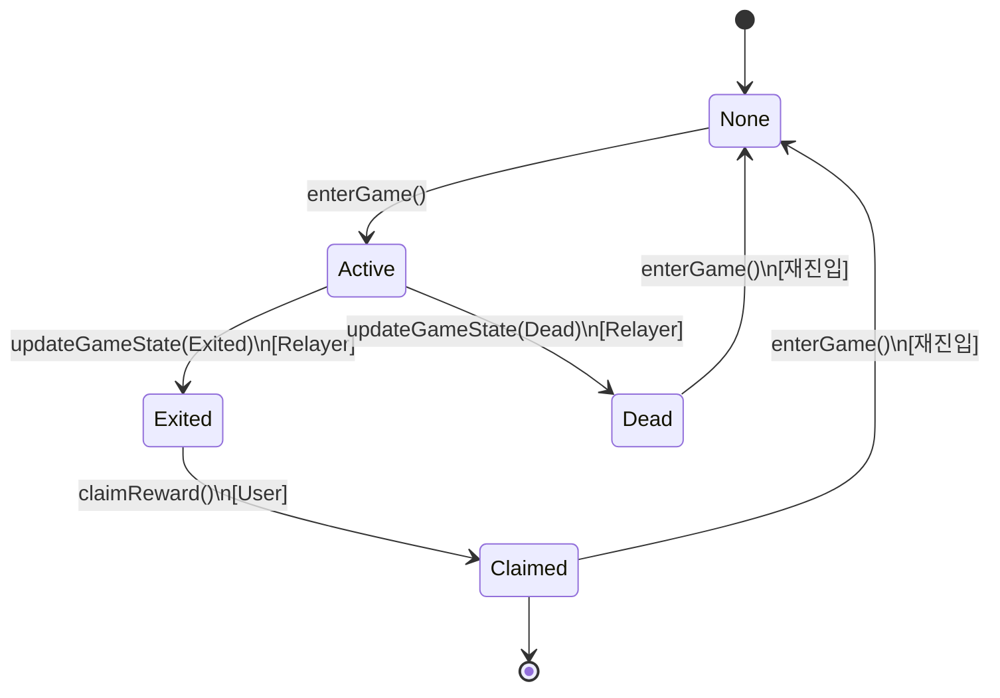

# WormGame 상태 머신 다이어그램

## 1. 상태(State) 정의

```
┌─────────────────────────────────────────────────────┐
│ PlayerStatus (Enum)                                  │
├─────────────────────────────────────────────────────┤
│ 0. None       : 게임 참여 이력 없음 또는 초기화됨   │
│ 1. Active     : 게임 중 (생존)                       │
│ 2. Exited     : 탈출 성공 (정산 대기)                │
│ 3. Dead       : 사망 (정산 불가)                     │
│ 4. Claimed    : 정산 완료                            │
└─────────────────────────────────────────────────────┘
```

---

## 2. 상태 전이 다이어그램 (State Transition Diagram)



---

## 3. 상태 전이 규칙

### 3.1 가능한 전이 (Allowed Transitions)

| From | To | Trigger | Who | Condition |
|------|-----|---------|-----|-----------|
| None | Active | `enterGame()` | User | amount > 0 |
| Active | Exited | `updateGameState()` | Relayer | 탈출 성공 |
| Active | Dead | `updateGameState()` | Relayer | 사망 |
| Exited | Claimed | `claimReward()` | User | 보상 있음 |
| Dead | None | `enterGame()` | User | 재진입 |
| Claimed | None | `enterGame()` | User | 재진입 |

### 3.2 불가능한 전이 (Blocked Transitions)

| From | To | Reason |
|------|-----|--------|
| Active | Active | `AlreadyInGame` 에러 |
| Active | Claimed | `updateGameState()` 없이 불가능 |
| Dead | Exited | 사망 후 탈출 불가 |
| Dead | Claimed | 정산 권한 없음 (`NotExited`) |
| Claimed | Exited | 이미 정산 완료 |
| Claimed | Dead | 이미 종료된 게임 |

---

## 4. 함수별 상태 검증

### 4.1 `enterGame()` (유저 호출)

```solidity
function enterGame(address token, uint256 amount) external {
    PlayerData storage player = players[msg.sender];

    // 검증 1: 금액이 0보다 커야 함
    if (amount == 0) revert InvalidAmount();

    // 검증 2: 이미 게임 중이 아니어야 함
    if (player.status == PlayerStatus.Active) {
        revert AlreadyInGame();
    }

    // 이전 게임이 종료되었으면 초기화
    if (player.status == PlayerStatus.Claimed ||
        player.status == PlayerStatus.Dead) {
        delete players[msg.sender];
    }

    // 상태 변경: None/Dead/Claimed → Active
    player.status = PlayerStatus.Active;
}
```

**허용되는 이전 상태**:
- ✅ None
- ✅ Dead (재진입)
- ✅ Claimed (재진입)
- ❌ Active (차단)
- ❌ Exited (차단)

---

### 4.2 `updateGameState()` (Relayer 호출)

```solidity
function updateGameState(
    address player,
    PlayerStatus newStatus,
    address[] calldata rewardTokens,
    uint256[] calldata rewardAmounts
) external onlyRelayer {
    PlayerData storage playerData = players[player];

    // 검증 1: Active 상태여야만 업데이트 가능
    if (playerData.status != PlayerStatus.Active) {
        revert InvalidStatus();
    }

    // 검증 2: Exited 또는 Dead만 가능
    if (newStatus != PlayerStatus.Exited && newStatus != PlayerStatus.Dead) {
        revert InvalidStatus();
    }

    // 상태 변경: Active → Exited/Dead
    playerData.status = newStatus;
}
```

**허용되는 전이**:
- ✅ Active → Exited
- ✅ Active → Dead
- ❌ 그 외 모든 전이 차단

**권한**:
- ✅ Relayer만 호출 가능
- ❌ Owner도 호출 불가
- ❌ User도 호출 불가

---

### 4.3 `claimReward()` (유저 호출)

```solidity
function claimReward() external nonReentrant {
    PlayerData storage player = players[msg.sender];

    // 검증 1: Exited 상태여야 함
    if (player.status != PlayerStatus.Exited) {
        revert NotExited();
    }

    // 검증 2: 보상이 있어야 함
    if (player.rewardTokens.length == 0) {
        revert NoRewardToClaim();
    }

    // 상태 변경: Exited → Claimed (재진입 방지)
    player.status = PlayerStatus.Claimed;

    // 토큰 전송
    for (uint256 i = 0; i < player.rewardTokens.length; i++) {
        IERC20(player.rewardTokens[i]).transfer(...);
    }
}
```

**허용되는 이전 상태**:
- ✅ Exited만 가능
- ❌ Active 차단 (`NotExited`)
- ❌ Dead 차단 (`NotExited`)
- ❌ Claimed 차단 (`NotExited`)

**재진입 방지**:
1. 상태를 먼저 `Claimed`로 변경
2. 그 후 토큰 전송
3. 재호출 시 `status != Exited`로 차단

---

## 5. 시나리오별 흐름

### 5.1 성공 시나리오 (Happy Path)

```
1. 유저가 입장
   └─ None → Active

2. 게임 플레이 (오프체인)
   └─ Active 유지

3. 탈출 성공
   └─ Active → Exited (Relayer가 처리)

4. 정산
   └─ Exited → Claimed (유저가 호출)

5. 재진입
   └─ Claimed → Active (새 게임 시작)
```

### 5.2 사망 시나리오

```
1. 유저가 입장
   └─ None → Active

2. 게임 플레이 (오프체인)
   └─ Active 유지

3. 사망
   └─ Active → Dead (Relayer가 처리)

4. 정산 시도
   └─ Dead → X (차단됨, NotExited)

5. 재진입
   └─ Dead → Active (새 게임 시작)
```

### 5.3 공격 시나리오 (차단)

```
시나리오 1: Active 상태에서 정산 시도
Active → claimReward() → ❌ NotExited

시나리오 2: Dead 상태에서 정산 시도
Dead → claimReward() → ❌ NotExited

시나리오 3: 일반 유저가 상태 변경 시도
User → updateGameState() → ❌ OnlyRelayer

시나리오 4: 중복 정산
Exited → claimReward() → Claimed
Claimed → claimReward() → ❌ NotExited

시나리오 5: 게임 중 재입장
Active → enterGame() → ❌ AlreadyInGame
```

---

## 6. 상태별 특성

| Status | Can Enter? | Can Exit? | Can Claim? | Can Die? |
|--------|-----------|----------|-----------|---------|
| None | ✅ Yes | ❌ No | ❌ No | ❌ No |
| Active | ❌ No | ✅ Yes (Relayer) | ❌ No | ✅ Yes (Relayer) |
| Exited | ❌ No | ❌ No | ✅ Yes | ❌ No |
| Dead | ✅ Yes (Re-entry) | ❌ No | ❌ No | ❌ No |
| Claimed | ✅ Yes (Re-entry) | ❌ No | ❌ No | ❌ No |

---

## 7. 이벤트별 상태 기록

### 7.1 `GameEntered`

```solidity
event GameEntered(
    address indexed player,
    address token,
    uint256 amount,
    uint256 gameId,
    uint256 timestamp
);
```

**발생 시점**: `enterGame()` 성공 시
**상태 변화**: → Active

---

### 7.2 `GameStateUpdated`

```solidity
event GameStateUpdated(
    address indexed player,
    PlayerStatus newStatus,
    uint256 gameId,
    address[] rewardTokens,
    uint256[] rewardAmounts
);
```

**발생 시점**: `updateGameState()` 성공 시
**상태 변화**: Active → Exited/Dead

---

### 7.3 `RewardClaimed`

```solidity
event RewardClaimed(
    address indexed player,
    uint256 gameId,
    address[] tokens,
    uint256[] amounts
);
```

**발생 시점**: `claimReward()` 성공 시
**상태 변화**: Exited → Claimed

---

## 8. 데이터 구조

```solidity
struct PlayerData {
    PlayerStatus status;           // 현재 상태
    address entryToken;            // 입장료 토큰
    uint256 entryAmount;           // 입장료 수량
    address[] rewardTokens;        // 보상 토큰 배열
    uint256[] rewardAmounts;       // 보상 수량 배열
    uint256 enteredAt;             // 입장 시간
    uint256 gameId;                // 게임 세션 ID
}
```

**gameId의 역할**:
- 같은 유저의 여러 게임 세션 구분
- 재진입 시 증가
- 통계 및 감사용

---

## 9. 불변 조건 (Invariants)

### 9.1 상태 무결성

```
✅ 항상 하나의 상태만 가짐
✅ None ↔ Active ↔ Exited/Dead ↔ Claimed 순환
✅ 역방향 전이 불가 (Dead → Exited 불가)
```

### 9.2 보상 무결성

```
✅ Exited 상태만 보상 배열 보유
✅ Dead 상태는 보상 = 0
✅ Claimed 후 재정산 불가
```

### 9.3 권한 무결성

```
✅ updateGameState()는 Relayer만 호출
✅ enterGame(), claimReward()는 유저만 호출
✅ setRelayer()는 Owner만 호출
```

---

## 10. 테스트 매트릭스

| Test Case | Initial State | Action | Expected State | Expected Result |
|-----------|--------------|--------|---------------|-----------------|
| T1 | None | enterGame() | Active | ✅ Success |
| T2 | Active | enterGame() | Active | ❌ AlreadyInGame |
| T3 | Active | updateGameState(Exited) | Exited | ✅ Success |
| T4 | Active | updateGameState(Dead) | Dead | ✅ Success |
| T5 | Exited | claimReward() | Claimed | ✅ Success |
| T6 | Active | claimReward() | Active | ❌ NotExited |
| T7 | Dead | claimReward() | Dead | ❌ NotExited |
| T8 | Claimed | claimReward() | Claimed | ❌ NotExited |
| T9 | Dead | enterGame() | Active | ✅ Success (Re-entry) |
| T10 | Claimed | enterGame() | Active | ✅ Success (Re-entry) |
| T11 | Active | updateGameState() [User] | Active | ❌ OnlyRelayer |

---

이 상태 머신은 **명확한 규칙**과 **강력한 검증**을 통해 **보안과 투명성**을 보장합니다! 🎮
